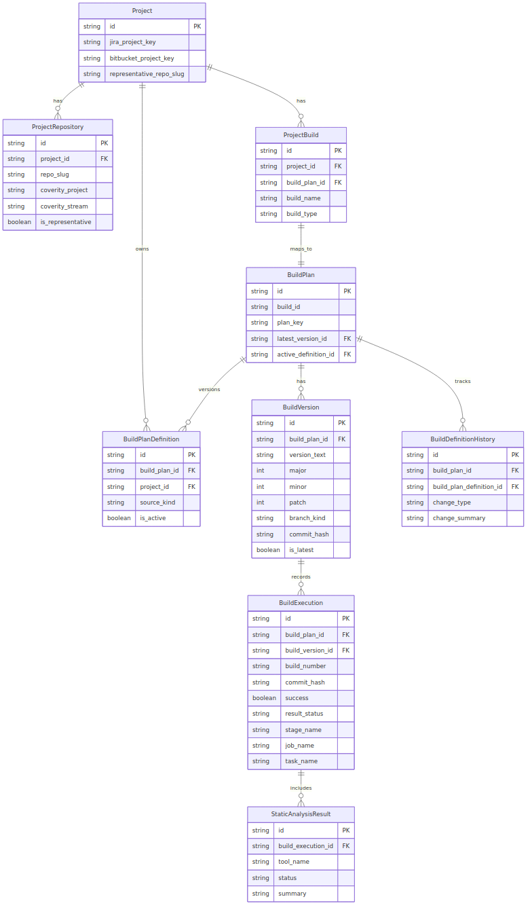

# Design: bamboo_spec_generator 상세 설계

## 문서 메타데이터

- 문서 일자: 2026-03-25
- 문서 유형: Design
- 상태: 초안
- 관련 SAD: [./SAD.md](./SAD.md)
- 관련 SRS: [../requirements/SRS.md](../requirements/SRS.md)

## 요약

이 문서는 제품의 상세 설계를 한 곳에 모은다. 범위는 JSON 입력 스키마, 저장소 연결 및 브랜치 트리거, 작업 하위 경로, MSBuild 보정, 스크립트 자산 렌더링, 빌드 메타데이터 DB 모델, 운영 백엔드/API/조회 UI 설계, 다중 CI 도구 공통 모델 확장, 그리고 장기 확장 범위인 배포/릴리스 관리 상세 설계다.

함수 단위 또는 특정 구현 흐름의 상세 설계가 필요할 때는 `detailed_designs/` 아래에 별도 문서를 추가한다.

## 구현 범위 구분

- 1~5장은 현재 구현과 직접 연결되는 상세 설계다.
- 6장은 ORM, migration, selector/service, 실행 이력/버전/정적분석 저장까지 부분 구현되었다.
- 7~12장은 향후 DB 및 운영 메타데이터 확장을 위한 상세 설계다.
- 저장소 연결의 `branches`, `create_if_missing`, `applicationLink`는 현재 Java Specs 생성까지 반영된다. 남은 범위는 운영 환경별 application link 값 공급과 세부 운영 정책 확정이다.
- 현재 추가된 함수 단위 상세 설계:
  - [프로젝트 등록 및 Specs 생성 준비도](./detailed_designs/project_registration_and_generation_readiness.md)
- 현재 추가된 제품 상세 설계:
  - [다중 CI 콘솔 모드 전환 및 공통 도메인 모델](./detailed_designs/multi_ci_console_and_provider_model.md)
  - [CI/CD 공통 백엔드 모델 일반화 검토](./detailed_designs/backend_model_generalization_review.md)
  - [BuildUnit 중심 백엔드 모델 초안](./detailed_designs/buildunit_backend_model_draft.md)
  - [BuildUnit 중심 백엔드 모델 ERD](./detailed_designs/buildunit_backend_model_erd.md)
- 현재 추가된 결정사항 문서:
  - [다중 CI 콘솔 결정사항](./detailed_designs/multi_ci_console_decisions.md)
- Jenkins 등록/모드 전환 상세 설계는 아직 별도 문서가 없으며 후속 상세 설계 범위다.
- 백엔드 모델 전환은 기존 `BuildUnit` 계열 호환 유지가 아니라 `BuildUnit` 중심 재구축을 기본 전제로 한다.

## 1. 입력 JSON 설계

### 파일 배치 규칙

- 입력 파일은 `build_info_json/<year>/<buildId>.json` 구조를 권장한다.
- 연도는 JSON 내부 필드가 아니라 디렉터리명에서 해석한다.
- DB 기반 활성 정의에서는 디렉터리 정보가 없으므로, 연도를 `BuildUnitDefinition.year` 같은 별도 컬럼으로 저장한다.

### 최상위 구조

```json
{
  "buildId": "sample-app-api",
  "name": "Sample App API",
  "planKey": "SAMPAPI",
  "description": "Sample App API build plan",
  "language": "java",
  "compiler": "maven",
  "repository": {
    "provider": "bitbucket",
    "projectKey": "SAMPLE",
    "repoSlug": "sample-app-api",
    "linkageMode": "linked",
    "applicationLink": "BITBUCKET_SERVER",
    "branches": ["dev", "release", "master"]
  },
  "requirements": {
    "os": "linux",
    "extraCapabilities": []
  },
  "build": {
    "subPath": ".",
    "prepareCommand": "mvn -B dependency:go-offline",
    "buildCommand": "mvn -B clean package",
    "staticAnalysis": {
      "customTool": {
        "commands": [
          "custom-tool analyze {buildCommand}"
        ]
      }
    },
    "runtimeRequirements": {
      "commands": ["mvn", "coverity", "custom-tool", "trigger-plan"],
      "envVars": ["PATH", "JAVA_HOME"]
    },
    "postBuildTrigger": {
      "type": "plan",
      "targetPlanKey": "POSTBUILD"
    }
  }
}
```

### 검증 규칙

- `buildId`, `planKey`, `language`, `compiler`, `repository`, `requirements`, `build`는 필수다.
- `repository.branches`는 생략 시 `dev`, `release`, `master`를 기본값으로 사용한다.
- `repository.applicationLink`는 `create_if_missing`일 때 필수이며 Bamboo Application Link 이름을 의미한다.
- `build.subPath`는 저장소 내부 상대경로여야 한다.
- `staticAnalysis.customTool.commands`에는 `analyze {buildCommand}` 패턴이 포함되어야 한다.
- `build.runtimeRequirements.commands`와 `build.runtimeRequirements.envVars`는 현재 구현 기준 필수다.

## 2. 저장소 연결 및 브랜치 트리거 설계

### 저장소 모델

- `provider`
- `projectKey`
- `repoSlug`
- `linkageMode`
- `applicationLink`
- `branches`

### 연결 모드

- `linked`
  - Bamboo에 사전 등록된 linked repository 참조
- `create_if_missing`
  - Bamboo plan-local Bitbucket repository를 생성한다.
  - `applicationLink`를 통해 Bamboo의 Bitbucket Application Link 이름을 참조한다.

### 브랜치 정책

- 기본 브랜치는 `dev`, `release`, `master`
- 생성 순서는 `dev=1`, `release=2`, `master=3`
- `release`는 초기 범위에서 단일 브랜치명
- 현재 구현은 `repositoryBranches(...)`, `planBranchManagement(...)`, `BitbucketServerTrigger` 생성까지 수행한다.

## 3. 공통 워크플로우 및 작업 하위 경로 설계

### 워크플로우

1. `Prepare`
2. `Build`
3. `Static Analysis`
4. `Trigger Follow-up`

### 정적분석 Job

- `Coverity Scan`
- `Custom Analysis`

### 작업 하위 경로

- `build.subPath`가 있으면 준비, 빌드, 정적분석 스크립트는 모두 해당 경로 기준으로 동작한다.
- 생략 시 저장소 루트를 사용한다.
- 보조 파일 생성 위치도 동일 기준을 따른다.

## 4. MSBuild 보정 설계

### 적용 조건

- `compiler` 또는 빌드 명령으로 MSBuild 기반 플랜임을 식별할 수 있어야 한다.

### 실행 규칙

- 실제 MSBuild 호출 직전에 `Directory.Build.targets`를 생성한다.
- 생성 위치는 실제 작업 하위 경로다.
- Visual Studio 환경 설정 스크립트는 환경변수 기준으로 로드한다.

### 최소 보정 방향

- 최적화 관련 속성 무력화
- C++ 툴체인 환경변수 로드

## 5. 스크립트 자산 설계

### 디렉터리 구조

```text
scripts/plan_tasks/
  common/
    py/
    sh/
    bat/
  fragments/
    py/
    sh/
    bat/
  overlays/
    compiler/
    task/
```

### 렌더링 순서

1. 기본 자산 선택
2. OS/컴파일러/Task 오버레이 계산
3. 조각 결합
4. 플레이스홀더 치환
5. 최종 스크립트 정규화

### 대표 플레이스홀더

- `{{BUILD_ID}}`
- `{{SUB_PATH}}`
- `{{PREPARE_COMMAND}}`
- `{{BUILD_COMMAND}}`
- `{{TARGET_PLAN_KEY}}`

## 6. 빌드 메타데이터 DB 설계

현재 일부 구현 범위다. ORM 모델, migration, 정의 import/sync, 실행 이력/버전 저장, 정적분석 결과 upsert, publish 이력 저장이 포함된다.

### 논리 엔터티

- `Project`
  - Jira/Bitbucket/Coverity와 CI 도구 유형 관점의 상위 프로젝트 메타데이터
- `ProjectRepository`
  - 프로젝트에 속한 개별 저장소 메타데이터
- `BuildUnit` (프로젝트 빌드)
  - 프로젝트에 속한 개별 빌드 항목
- `CiProvider`
  - Bamboo, Jenkins 같은 CI 도구 구분값 또는 동등한 표현
- `BuildUnit`
  - Bamboo 플랜 또는 Jenkins 잡과 연결 가능한 공통 빌드 단위 대표 정보와 `latest_version_id`
- `BambooBuildInfo`
  - 플랜 아래 다중 OS/언어/컴파일러/명령 조합을 보관하는 빌드 상세 메타데이터
- `BuildUnitDefinition`
  - 생성기 입력 정의 스냅샷
- `BuildVersion`
  - 버전 대표 상태와 최신 요약
- `BuildExecution`
  - 개별 빌드 실행 이력
- `BambooPublishExecution`
  - Bamboo Specs publish 시도 이력과 preview/export draft snapshot
- `StaticAnalysisResult`
  - 정적분석 결과 상세
- `BuildDefinitionHistory`
  - 정의 변경 이력
- `SystemSetting`
  - Coverity/Bamboo/Git clone URL/repository linkage mode 같은 운영 공통 설정

### 공통 모델 확장 방향

- 프로젝트, 빌드 단위, 운영 현황 응답은 `ci_provider` 필드를 통해 Bamboo와 Jenkins를 구분한다.
- UI와 API에서는 가능한 범위에서 `plan`과 `job`을 공통 `빌드 단위`로 추상화하고, 도구별 상세 화면에서만 고유 용어를 드러낸다.
- Bamboo 전용 필드와 Jenkins 전용 필드는 공통 대표 엔터티에 직접 혼합하기보다 확장 테이블, JSON 필드, 또는 도구별 상세 모델로 분리하는 방향을 우선 검토한다.

## 7. 공통 CI 콘솔 UI 설계 방향

### 모드 전환

- 상단 주요 네비게이션에 `Bamboo 관리`, `Jenkins 관리` 전환 컨트롤을 둔다.
- 현재 모드는 URL, 세션, 또는 동등한 상태 모델로 일관되게 유지한다.
- 모드 전환 후에도 메뉴 구조와 화면 배치는 가능한 범위에서 동일하게 유지한다.

### 테마

- Bamboo 모드는 밝은 파란색 계열을 대표 색상으로 사용한다.
- Jenkins 모드는 밝은 빨간색 계열을 대표 색상으로 사용한다.
- 상태 배지와 심각도 색상은 도메인 의미를 우선하고, 브랜드 테마 색상은 레이아웃 포인트와 주요 CTA에 우선 적용한다.

### 정보 구조

- 프로젝트 목록, 프로젝트 상세, 빌드 단위 목록, 빌드 단위 상세, 운영 현황 대시보드는 공통 구조를 유지한다.
- 공통 화면 문구는 일반적인 CI 운영 용어를 우선 사용한다.
- 도구별 고유 용어는 세부 패널이나 상세 필드 라벨에서만 제한적으로 노출한다.

### 향후 확장 엔터티

- `DeploymentEnvironment`
  - `dev`, `qa`, `staging`, `prod` 같은 배포 대상 환경
- `Release`
  - 배포 후보가 되는 릴리스 단위
- `DeploymentExecution`
  - 환경별 배포 실행 이력
- `DeploymentApproval`
  - 승인/거절/재시도 이력

### 핵심 필드 예시

- `Project`
  - `jira_project_key`, `bitbucket_project_key`, `representative_repo_slug`
- `ProjectRepository`
  - `repo_slug`, `coverity_project`, `coverity_stream`, `is_representative`
- `BuildUnit` (프로젝트 빌드)
  - `project_id`, `build_unit_id`, `build_name`, `build_type`
- `BuildUnit`
  - `build_id`, `plan_key`, `static_analysis_tool_version`, `coverity_project`, `repository_linkage_mode_override`, `latest_version_id`
- `BambooBuildInfo`
  - `build_key`, `operating_system`, `language`, `compiler`, `pre_process`, `build_command`, `clean_command`, `coverity_stream`, `build_sub_path`
- `BuildVersion`
  - `version_text`, `major`, `minor`, `patch`, `branch_kind`, `commit_hash`, `is_latest`
- `BuildExecution`
  - `build_number`, `commit_hash`, `success`, `result_status`, `stage_name`, `job_name`, `task_name`
- `BambooPublishExecution`
  - `status`, `message`, `output`, `return_code`, `snapshot_preview_json`, `snapshot_export_draft_json`
- `SystemSetting`
  - `key`, `value`, `description`

### 프로젝트/저장소/빌드 관계

- 하나의 `Project`는 여러 `ProjectRepository`를 가질 수 있다.
- 하나의 `Project`는 여러 `BuildUnit` (프로젝트 빌드)를 가질 수 있다.
- 하나의 `BuildUnit` (프로젝트 빌드)는 하나의 `BuildUnit`과 연결된다.
- 하나의 `BuildUnit`은 여러 `BambooBuildInfo`를 가질 수 있다.
- 결과 취합 시에는 `BuildUnit` 단위 조회뿐 아니라 상위 `Project`에 연결된 모든 `ProjectRepository`를 함께 조회할 수 있어야 한다.
- 장기적으로는 `BuildVersion -> Release -> DeploymentExecution -> DeploymentEnvironment` 흐름으로 CD 상태를 이어서 추적할 수 있어야 한다.

### 현재 구현된 운영 흐름

- 등록 메타데이터와 `BambooBuildInfo`를 조합해 활성 정의와 prepare context를 합성한다.
- 플랜 단위 preview/export draft를 생성해 UI와 publish 기록에서 재사용한다.
- Specs draft 초기화 서비스가 등록된 메타데이터를 기준으로 `BambooBuildInfo`를 보정하거나 생성한다.
- Bamboo 연동 서비스가 plan status/detail 조회, Specs publish, plan queue 실행, publish 이력 저장을 수행한다.

### ERD 초안

렌더링 파일:

- [SVG](./assets/build-metadata-erd.svg)
- [PNG](./assets/build-metadata-erd.png)

#RK|```mermaid
#HT|erDiagram
#XX|    Project ||--o{ ProjectRepository : has
#QM|    Project ||--o{ BuildUnit : has
#RZ|    BuildUnit ||--o{ BuildUnitDefinition : has
#NW|    BuildUnit ||--o{ BuildVersion : has
#TV|    BuildUnit ||--o{ BuildExecution : has
#WQ|    BuildVersion ||--o{ BuildExecution : records
#XR|    BuildExecution ||--o{ StaticAnalysisResult : includes
#QY|    BuildUnit ||--o{ BuildDefinitionHistory : tracks
#HQ|    BuildUnit ||--o{ BambooPublishExecution : publishes
#PS|    BuildUnit ||--|| BambooBuildUnit : bamboo
#XB|    BuildUnit ||--|| JenkinsBuildUnit : jenkins
#BQ|    BambooBuildUnit ||--o{ BambooBuildInfo : has
#PS|

    Project {
        string id PK
        string jira_project_key
        string bitbucket_project_key
        string representative_repo_slug
    }

    ProjectRepository {
        string id PK
        string project_id FK
        string repo_slug
        string coverity_project
        string coverity_stream
        boolean is_representative
    }

    #QP|    BuildUnit {
#PN|        string id PK
#BM|        string project_id FK
#VW|        string ci_provider
#VJ|        string external_key
#TZ|        string display_name
#PX|        string unit_type
#PQ|        string language
#KM|        string compiler
#NH|        string latest_version_id FK
#PX|    }
#BQ|
#NH|    BambooBuildUnit {
#PN|        string build_unit_id PK (FK)
#KJ|        string plan_key
#PS|        string build_id
#JV|        string static_analysis_tool_version
#TH|        string coverity_project
#PR|        string repository_linkage_mode_override
#PX|    }
#SQ|
#NH|    JenkinsBuildUnit {
#PN|        string build_unit_id PK (FK)
#KJ|        string job_path
#PS|        string job_type
#JV|        string folder_path
#PX|    }
#BQ|

    BambooBuildInfo {
        string id PK
        string build_unit_id FK
        string build_key
        string operating_system
        string language
        string compiler
        string coverity_stream
        string build_sub_path
    }

    BuildUnitDefinition {
        string id PK
        string build_unit_id FK
        string project_id FK
        string year
        string source_kind
        boolean is_active
    }

    BuildVersion {
        string id PK
        string build_unit_id FK
        string version_text
        int major
        int minor
        int patch
        string branch_kind
        string commit_hash
        boolean is_latest
    }

    BuildExecution {
        string id PK
        string build_unit_id FK
        string build_info_id FK
        string build_version_id FK
        string build_number
        string commit_hash
        boolean success
        string result_status
        string stage_name
        string job_name
        string task_name
    }

    StaticAnalysisResult {
        string id PK
        string build_execution_id FK
        string tool_name
        string status
        string summary
    }

    BuildDefinitionHistory {
        string id PK
        string build_unit_id FK
        string build_plan_definition_id FK
        string change_type
        string change_summary
    }

    BambooPublishExecution {
        string id PK
        string build_unit_id FK
        string status
        int return_code
    }
```

미리보기:



### ERD 해설

- `Project`가 상위 집계 루트다.
- `ProjectRepository`는 프로젝트에 속한 여러 저장소를 표현한다.
- `BuildUnit` (프로젝트 빌드)는 프로젝트 아래 여러 빌드 항목을 표현한다.
- `BuildUnit`은 Bamboo 플랜 단위의 대표 엔터티다.
- `BambooBuildInfo`는 플랜 아래 실제 생성 단위를 세분화하는 빌드 상세 메타데이터다.
- `BuildUnitDefinition`은 생성기 입력 스냅샷을 나타낸다.
- `BuildVersion`은 버전 단위 대표 상태를 가진다.
- `BuildExecution`은 실제 실행 이력을 누적 저장한다.
- `StaticAnalysisResult`는 실행 단위의 정적분석 결과를 분리 저장한다.
- `BuildDefinitionHistory`는 정의 변경 이력을 남긴다.
- `BambooPublishExecution`은 Bamboo 반영 시도의 결과와 snapshot을 저장한다.

### 준비 스테이지 조회 관점

- 준비 스테이지는 `BuildUnit`에서 시작해 `BuildUnit` (프로젝트 빌드), `Project`, `ProjectRepository`를 따라가며 메타데이터를 조회한다.
- 현재 플랜에 직접 연결된 저장소뿐 아니라 같은 `Project`에 속한 전체 저장소를 함께 조회할 수 있어야 한다.
- 대표 저장소 정보는 `Project.representative_repo_slug` 또는 `ProjectRepository.is_representative=true`로 판별할 수 있어야 한다.

### 준비 스테이지용 변수 조회

준비 스테이지 시작 시 다음 값을 DB에서 조회해 변수 컨텍스트로 만들 수 있어야 한다.

- `JIRA_PROJECT_KEY`
- `BITBUCKET_PROJECT_KEY`
- `BITBUCKET_REPO_SLUG`
- `REPRESENTATIVE_REPO_SLUG`
- `COVERITY_PROJECT`
- `COVERITY_STREAM`
- 프로젝트 내 현재 빌드 식별 정보

현재 빌드 정의가 프로젝트 아래 여러 빌드 중 하나일 수 있으므로, 예를 들어 다음과 같은 구성이 가능해야 한다.

- `frontend` / `Node.js`
- `backend` / `python`

이 변수 컨텍스트는 준비 스크립트에서 바로 읽을 수 있는 형태로 전달하는 방향이 바람직하다.

### 물리 스키마 초안

#### Project

- 목적: Jira/Bitbucket/Coverity 기준의 상위 프로젝트 식별자 보관
- 주요 컬럼
  - `id`: PK
  - `jira_project_key`: not null
  - `bitbucket_project_key`: not null
  - `representative_repo_slug`: nullable
  - `created_at`, `updated_at`: not null
- 제약
  - `jira_project_key` unique
  - `(bitbucket_project_key, representative_repo_slug)`는 대표 저장소를 별도 관리하지 않는 경우 조회 보조 키로 사용 가능

#### ProjectRepository

- 목적: 프로젝트에 속한 각 저장소와 분석 설정 보관
- 주요 컬럼
  - `id`: PK
  - `project_id`: FK -> `Project.id`, not null
  - `repo_slug`: not null
  - `coverity_project`: nullable
  - `coverity_stream`: nullable
  - `is_representative`: not null, default false
  - `created_at`, `updated_at`: not null
- 제약
  - `(project_id, repo_slug)` unique
  - 대표 저장소는 프로젝트당 1건만 허용하는 partial unique index 후보

#### BuildUnit

- 목적: 하나의 프로젝트 아래 여러 빌드 항목 구분
- 주요 컬럼
  - `id`: PK
  - `project_id`: FK -> `Project.id`, not null
  - `build_unit_id`: FK -> `BuildUnit.id`, not null
  - `build_name`: not null
  - `build_type`: not null
  - `runtime_stack`: nullable
  - `created_at`, `updated_at`: not null
- 제약
  - `(project_id, build_name)` unique
  - `build_unit_id` unique

#### BuildUnit

- 목적: Bamboo 플랜 대표 엔터티
- 주요 컬럼
  - `id`: PK
  - `build_id`: not null
  - `plan_key`: not null
  - `static_analysis_tool_version`: nullable
  - `coverity_project`: nullable
  - `repository_linkage_mode_override`: nullable
  - `latest_version_id`: nullable FK -> `BuildVersion.id`
  - `created_at`, `updated_at`: not null
- 제약
  - `build_id` unique
  - `plan_key` unique

#### BambooBuildInfo

- 목적: 플랜 아래 빌드별 상세 명령, OS, 언어, 컴파일러, 하위 경로를 보관
- 주요 컬럼
  - `id`: PK
  - `build_unit_id`: FK -> `BuildUnit.id`, not null
  - `build_key`: not null
  - `operating_system`: nullable
  - `pre_process`, `clean_command`, `build_command`: nullable
  - `language`, `compiler`: nullable
  - `analysis_excluded_files`: nullable
  - `coverity_stream`: nullable
  - `build_sub_path`: nullable
  - `created_at`, `updated_at`: not null
- 제약
  - `(build_unit_id, build_key)` unique

#### BuildUnitDefinition

- 목적: 생성기 입력 정의의 스냅샷과 활성 정의 관리
- 주요 컬럼
  - `id`: PK
  - `build_unit_id`: FK -> `BuildUnit.id`, not null
  - `project_id`: FK -> `Project.id`, not null
  - `year`: not null
  - `source_kind`: not null
  - `definition_json`: not null
  - `definition_hash`: not null
  - `is_active`: not null, default false
  - `created_at`: not null
- 제약
  - `(build_unit_id, definition_hash)` unique
  - JSON 입력에서 해석한 연도를 DB 적재 시 별도 컬럼으로 보존한다.
  - 활성 정의는 플랜당 1건만 허용하는 partial unique index 후보

#### BuildVersion

- 목적: 플랜 버전과 최신 대표 상태 보관
- 주요 컬럼
  - `id`: PK
  - `build_unit_id`: FK -> `BuildUnit.id`, not null
  - `version_text`: not null
  - `major`, `minor`, `patch`: not null
  - `branch_kind`: not null
  - `commit_hash`: not null
  - `is_latest`: not null, default false
  - `latest_execution_id`: nullable FK -> `BuildExecution.id`
  - `latest_success`: nullable
  - `created_at`, `updated_at`: not null
- 제약
  - `(build_unit_id, version_text)` unique
  - `(build_unit_id, commit_hash)` unique
  - `branch_kind`는 `master`, `release`, `dev` enum 후보

#### BuildExecution

- 목적: 버전 재시도를 포함한 실제 실행 이력 누적
- 주요 컬럼
  - `id`: PK
  - `build_unit_id`: FK -> `BuildUnit.id`, not null
  - `build_version_id`: FK -> `BuildVersion.id`, not null
  - `build_number`: not null
  - `commit_hash`: not null
  - `success`: not null
  - `result_status`: not null
  - `summary_message`: nullable
  - `stage_name`, `job_name`, `task_name`: nullable
  - `started_at`, `finished_at`: nullable
  - `created_at`: not null
- 제약
  - `(build_unit_id, build_info_id, build_number)` unique
  - `commit_hash`는 버전의 `commit_hash`와 일치해야 함

#### StaticAnalysisResult

- 목적: 실행 단위 정적분석 요약과 세부 지표 보관
- 주요 컬럼
  - `id`: PK
  - `build_execution_id`: FK -> `BuildExecution.id`, not null
  - `tool_name`: not null
  - `status`: not null
  - `summary`: nullable
  - `metrics_json`: nullable
  - `created_at`: not null
- 제약
  - `(build_execution_id, tool_name)` unique

#### BuildDefinitionHistory

- 목적: 정의 변경 이력과 변경 사유 보관
- 주요 컬럼
  - `id`: PK
  - `build_unit_id`: FK -> `BuildUnit.id`, not null
  - `build_plan_definition_id`: FK -> `BuildUnitDefinition.id`, not null
  - `change_type`: not null
  - `change_summary`: nullable

#### BambooPublishExecution

- 목적: Bamboo Specs publish 시도와 결과 snapshot 저장
- 주요 컬럼
  - `id`: PK
  - `build_unit_id`: FK -> `BuildUnit.id`, not null
  - `status`: not null
  - `message`: not null
  - `output`: nullable
  - `snapshot_preview_json`, `snapshot_export_draft_json`: nullable
  - `return_code`: nullable
  - `trigger_source`, `requested_by`: nullable
  - `created_at`, `updated_at`: not null

#### SystemSetting

- 목적: Coverity/Bamboo/repository linkage 같은 운영 공통 설정 저장
- 주요 컬럼
  - `id`: PK
  - `key`: not null
  - `value`: nullable
  - `description`: nullable
  - `created_at`, `updated_at`: not null
- 제약
  - `key` unique

### 인덱스 초안

- `ProjectRepository(project_id, is_representative)`
- `BuildUnit(project_id, build_name)`
- `BuildUnit(plan_key)`
- `BuildUnitDefinition(build_unit_id, is_active)`
- `BuildVersion(build_unit_id, is_latest)`
- `BuildVersion(build_unit_id, commit_hash)`
- `BuildExecution(build_unit_id, build_number desc)`
- `BuildExecution(build_version_id, created_at desc)`
- `StaticAnalysisResult(build_execution_id, tool_name)`

### 주요 조회 시나리오

#### 준비 스테이지 변수 조회

1. 입력: `plan_key`
2. `BuildUnit`에서 현재 플랜 식별
3. `BuildUnit` (프로젝트 빌드)로 프로젝트와 빌드 항목 식별
4. `Project`에서 Jira/Bitbucket 대표 값 조회
5. `ProjectRepository`에서 현재 저장소와 프로젝트 전체 저장소 목록 조회
6. 준비 스크립트 변수 컨텍스트로 변환

예시 반환 구조:

```json
{
  "JIRA_PROJECT_KEY": "SAMPLE",
  "BITBUCKET_PROJECT_KEY": "SAMPLE",
  "BITBUCKET_REPO_SLUG": "sample-app-api",
  "REPRESENTATIVE_REPO_SLUG": "sample-app-api",
  "COVERITY_PROJECT": "sample-app",
  "COVERITY_STREAM": "sample-app-dev",
  "PROJECT_BUILD_NAME": "backend",
  "PROJECT_BUILD_TYPE": "python"
}
```

#### 동일 커밋 재빌드 시작

1. 입력: `plan_key`, `commit_hash`
2. `BuildUnit.id` 조회
3. `BuildVersion(build_unit_id, commit_hash)` 조회
4. 있으면 기존 `BuildVersion.id`를 재사용하고, 중복 데이터가 존재하면 가장 높은 버전을 우선 선택
5. 없으면 브랜치 규칙에 따라 새 버전 생성
6. 항상 새 `BuildExecution` 생성

#### 프로젝트 단위 결과 취합

1. 입력: `jira_project_key` 또는 `project_id`
2. `ProjectRepository` 전체 조회
3. `BuildUnit` (프로젝트 빌드)와 `BuildUnit` 조회
4. 각 플랜의 `latest_version_id`와 최신 `BuildExecution` 조합
5. 프로젝트 단위 결과 요약 생성

### 트랜잭션 경계 초안

- 버전 계산, `BuildVersion` upsert, `BuildExecution` 생성은 하나의 트랜잭션으로 묶는다.
- 실행 종료 후 결과 갱신, `StaticAnalysisResult` 저장, `BuildVersion.latest_execution_id` 갱신도 하나의 트랜잭션으로 처리한다.
- `BuildUnit.latest_version_id`와 `BuildVersion.is_latest` 갱신은 동시에 처리해야 한다.

## 7. 버전 규칙 설계

현재 백엔드 서비스 계층에서 초안 구현되었다.

- 형식: `v<major>.<minor>.<patch>`
- `master`
  - `major + 1`, `minor = 0`, `patch = 0`
- `release`
  - `minor + 1`, `patch = 0`
- `dev`
  - `patch + 1`

초기 버전 시작값은 별도 정책으로 확정이 필요하다.

## 8. 동일 커밋 재빌드 설계

현재 백엔드 서비스 계층에서 초안 구현되었다.

### 처리 순서

1. `build_unit_id + commit_hash`로 기존 `BuildVersion` 조회
2. 있으면 해당 버전을 재사용하고, 중복 데이터가 있으면 가장 높은 버전을 대표값으로 선택
3. `BuildExecution`은 항상 새로 생성
4. 종료 후 `BuildVersion`의 최신 요약 필드 갱신
5. 필요 시 `BuildUnit.latest_version_id` 유지 또는 갱신

### 장점

- 동일 커밋 중복 버전 생성 방지
- 실행 이력 보존
- 대표 버전 상태와 재시도 실행 분리

## 9. 실패 위치 및 정적분석 결과 설계

실패 위치와 정적분석 결과 저장은 백엔드 서비스/API 기준으로 부분 구현되었고, 외부 빌드 시스템에서 이를 end-to-end로 적재하는 연동은 아직 미구현이다.

### 실패 위치

- `stage_name`
- `job_name`
- `task_name`

가능한 수준까지 저장하고, 식별 불가 항목은 비운다.

### 정적분석 결과

- `tool_name`
- `status`
- `summary`
- `metrics_json`

초기 구현은 `summary` 중심, 이후 세부 지표 확장

## 10. 생성기 연동 지점 설계

- `parser.py`
  - JSON loader 외에 DB loader 도입 가능
- `validator.py`
  - DB 조회 결과 검증 지원
- `model.py`
  - 공통 내부 모델 유지
- `generator.py`
  - 입력 소스와 무관한 공통 생성기 유지
- `script_assets.py`, `script_renderer.py`
  - 자산 선택과 렌더링 담당
- 향후 `db_context_loader.py` 또는 동등한 계층
  - 준비 스테이지용 프로젝트/저장소 메타데이터 조회 담당

현재 구현된 항목:

- `parser.py`: JSON loader
- `validator.py`: JSON 기반 검증
- `model.py`: 공통 내부 모델
- `generator.py`: Java Specs 생성
- `script_assets.py`, `script_renderer.py`: 자산 선택/렌더링
- `api_client.py`: 운영 API 활성 정의 조회 클라이언트
- `backend/`: Django 백엔드, ORM 모델, migration, Admin, Ninja API, 프로젝트 등록/수정, BuildInfo 관리, 운영 설정, 조회 UI
- `backend` 설정: SQLite/PostgreSQL 스위치와 개발용 DB 초기화 명령

현재 미구현 항목:

- DB loader
- JSON 적재/동기화 자동화
- 준비 스테이지 DB 변수의 실제 Bamboo 연동
- 운영 데이터의 end-to-end 수집/적재 흐름

## 11. 마이그레이션 설계

### 단계

1. JSON 우선 + DB 적재
2. JSON/DB 병행 검증
3. DB 우선 + JSON fallback
4. DB 단일 기준 소스

## 12. 무결성 고려사항

- `(build_unit_id, version_text)`는 유일해야 한다.
- `(build_unit_id, commit_hash)`는 버전 레벨 유일 제약이다.
- `latest_version_id`는 같은 플랜의 버전만 가리켜야 한다.
- 최신 포인터 갱신과 실행 결과 저장은 가능하면 같은 트랜잭션 경계에서 처리한다.

## 13. DB 구현 초안

부분 구현 범위다.

### DBMS 가정

- 초기 초안은 PostgreSQL 문법을 기준으로 작성한다.
- 이유는 partial unique index, check constraint, jsonb, CTE 기반 upsert 흐름을 비교적 단순하게 표현할 수 있기 때문이다.
- 다른 DBMS를 선택하더라도 논리 모델과 제약은 유지하고 문법만 치환하는 방향을 권장한다.

### 명명 규칙

- 테이블명은 snake_case 복수형 대신 단수형 엔터티 기준을 유지한다.
- 기본 키는 `id`
- 외래 키는 `<entity>_id`
- 시각 컬럼은 `created_at`, `updated_at`, `started_at`, `finished_at`
- 버전 문자열은 표시값 그대로 `vX.X.X` 형태를 `version_text`에 저장한다.

### 저장 규칙

- `BuildUnitDefinition.definition_json`은 입력 원문 스냅샷을 보관한다.
- `BuildUnitDefinition.definition_hash`는 동일 정의 중복 적재 방지에 사용한다.
- `BuildVersion`은 버전 대표 상태를 보관한다.
- `BuildExecution`은 실행 단위 상세 로그와 실패 위치를 보관한다.
- `StaticAnalysisResult.metrics_json`은 도구별 확장 지표를 보관한다.

### 권장 SQL 초안

- DDL 초안: [./sql/build_metadata_schema.sql](./sql/build_metadata_schema.sql)

### 애플리케이션 계층 경계

- `db_loader.py`
  - 활성 `BuildUnitDefinition`을 조회해 내부 `BuildDefinition`으로 변환
  - `definition_json`와 별도 `year` 컬럼을 조합해 내부 모델을 구성
- `db_context_loader.py`
  - 준비 스테이지 변수 컨텍스트 조회
- `version_resolver.py`
  - `plan_key`, `commit_hash` 기준 버전 조회/생성
  - 중복 데이터가 있으면 가장 높은 버전을 대표값으로 선택
- `execution_recorder.py`
  - 빌드 시작/종료, 성공 여부, 실패 위치 저장
- `static_analysis_recorder.py`
  - Coverity 및 커스텀 분석 결과 저장
- `definition_sync.py`
  - JSON 정의를 DB 정의 스냅샷으로 동기화

### 초기 구현 권장 순서

1. 스키마 DDL 확정
2. `BuildUnitDefinition` 적재 경로 구현
3. 준비 스테이지 조회 API 또는 조회 함수 구현
4. `BuildVersion` / `BuildExecution` 저장 경로 구현
5. 생성기 입력 어댑터를 JSON/DB 병행 구조로 확장

## 14. 운영 백엔드/API/조회 UI 설계

부분 구현 범위다.

### 운영 백엔드 방향

- 운영 백엔드는 Django 기반으로 분리한다.
- 영속 저장소는 PostgreSQL을 사용한다.
- Django ORM과 migration으로 `Project`, `ProjectRepository`, `BuildUnit` (프로젝트 빌드), `BuildUnit`, `BuildUnitDefinition`, `BuildVersion`, `BuildExecution`, `StaticAnalysisResult`, `BuildDefinitionHistory`를 관리한다.
- Django Admin은 초기 운영 관리 화면으로 활용할 수 있다.

### Django 프로젝트 구조 초안

```text
backend/
  manage.py
  config/
    settings/
      base.py
      local.py
      prod.py
    urls.py
    wsgi.py
    asgi.py
  apps/
    buildmeta/
      models/
      migrations/
      admin.py
      services/
      selectors/
    api/
      routers/
      schemas/
      auth.py
    ui/
      views.py
      urls.py
      templates/
```

구조 원칙:

- `buildmeta`
  - ORM 모델, 도메인 서비스, 조회 selector를 담당
- `api`
  - Ninja router, request/response schema, API 인증을 담당
- `ui`
  - 조회용 서버 렌더링 화면을 담당
- `src/bamboo_spec_generator`
  - 기존 생성기 본체와 API client를 담당

### Django 모델 매핑 초안

- `Project`
  - `uuid` PK
  - `jira_project_key`, `bitbucket_project_key`, `representative_repo_slug`
- `ProjectRepository`
  - `ForeignKey(Project)`
  - `repo_slug`, `coverity_project`, `coverity_stream`, `is_representative`
- `BuildUnit` (프로젝트 빌드)
  - `ForeignKey(Project)`
  - `OneToOneField(BuildUnit)`
  - `build_name`, `build_type`, `runtime_stack`
- `BuildUnit`
  - `build_id`, `plan_key`
  - `ForeignKey(BuildVersion, null=True, on_delete=PROTECT)` as `latest_version`
- `BuildUnitDefinition`
  - `ForeignKey(BuildUnit)`
  - `ForeignKey(Project)`
  - `year`, `source_kind`, `definition_json`, `definition_hash`, `is_active`
- `BuildVersion`
  - `ForeignKey(BuildUnit)`
  - `version_text`, `major`, `minor`, `patch`, `branch_kind`, `commit_hash`
  - `ForeignKey(BuildExecution, null=True, on_delete=PROTECT)` as `latest_execution`
  - `is_latest`, `latest_success`
- `BuildExecution`
  - `ForeignKey(BuildUnit)`
  - `ForeignKey(BuildVersion)`
  - `build_number`, `commit_hash`, `success`, `result_status`
  - `summary_message`, `stage_name`, `job_name`, `task_name`
  - `started_at`, `finished_at`
- `StaticAnalysisResult`
  - `ForeignKey(BuildExecution)`
  - `tool_name`, `status`, `summary`, `metrics_json`
- `BuildDefinitionHistory`
  - `ForeignKey(BuildUnit)`
  - `ForeignKey(BuildUnitDefinition)`
  - `change_type`, `change_summary`

### 서비스/셀렉터 분리 규칙

- `selectors`
  - 읽기 전용 질의
  - 예: `get_active_definition_by_plan_key`, `get_prepare_context_by_plan_key`
- `services`
  - 상태 변경 로직
  - 예: `sync_definition`, `resolve_version`, `record_execution_start`, `record_execution_finish`
- Ninja router는 ORM 직접 접근 대신 selector/service를 호출한다.
- UI view도 ORM 직접 접근 대신 selector를 재사용한다.

### API 방향

- 외부 및 내부 연동 API는 Django Ninja를 사용한다.
- 초기 API 범위
  - 프로젝트 목록/상세 조회
  - 저장소 목록 조회
  - 빌드 플랜 목록/상세 조회
  - 활성 빌드 정의 조회
  - 준비 스테이지 변수 컨텍스트 조회
  - 빌드 실행 결과 적재
  - 빌드 실행 이력 조회

### API 인증/권한 초안

- 생성기 전용 API
  - 기계 간 인증용 정적 토큰 또는 서비스 계정 토큰 사용
  - 최소 권한 원칙으로 `definition:read`, `prepare-context:read`, `execution:write`
- 운영 조회 API
  - Django 세션 인증 또는 사내 SSO 연동 가능 구조
  - 초기 범위는 내부망/관리자 중심으로 설계
- Admin
  - Django 기본 인증과 staff/superuser 권한 사용

### API 버전 전략

- 기본 prefix: `/api/v1`
- 브레이킹 변경은 `/api/v2`로 분리
- 생성기는 명시적 버전 prefix를 고정 사용한다.

### API 엔드포인트 초안

#### 1. 활성 빌드 정의 조회

- `GET /api/v1/build-plans/{plan_key}/active-definition`
- 목적: 생성기가 활성 빌드 정의를 조회
- 응답의 `year`는 `definition` JSON 내부가 아니라 DB의 `BuildUnitDefinition.year` 필드에서 제공한다.
- 응답 예시:

```json
{
  "planKey": "SAMPAPI",
  "buildId": "sample-app-api",
  "year": "2026",
  "definitionVersion": "sha256:abc123",
  "definition": {
    "buildId": "sample-app-api",
    "name": "Sample App API",
    "planKey": "SAMPAPI",
    "language": "java",
    "compiler": "maven",
    "repository": {
      "provider": "bitbucket",
      "projectKey": "SAMPLE",
      "repoSlug": "sample-app-api",
      "linkageMode": "linked",
      "branches": ["dev", "release", "master"]
    },
    "requirements": {
      "os": "linux",
      "extraCapabilities": []
    },
    "build": {
      "subPath": "services/sample-app-api",
      "prepareCommand": "mvn -B dependency:go-offline",
      "buildCommand": "mvn -B clean package"
    }
  }
}
```

#### 2. 준비 스테이지 변수 컨텍스트 조회

- `GET /api/v1/build-plans/{plan_key}/prepare-context`
- 목적: 준비 스테이지 시작 시 변수 컨텍스트 조회
- 응답 예시:

```json
{
  "planKey": "SAMPAPI",
  "project": {
    "jiraProjectKey": "SAMPLE",
    "bitbucketProjectKey": "SAMPLE",
    "representativeRepoSlug": "sample-app-api"
  },
  "currentRepository": {
    "repoSlug": "sample-app-api",
    "coverityProject": "sample-app",
    "coverityStream": "sample-app-dev"
  },
  "projectBuild": {
    "buildName": "backend",
    "buildType": "python"
  },
  "repositories": [
    {
      "repoSlug": "sample-app-api",
      "isRepresentative": true
    }
  ],
  "variables": {
    "JIRA_PROJECT_KEY": "SAMPLE",
    "BITBUCKET_PROJECT_KEY": "SAMPLE",
    "BITBUCKET_REPO_SLUG": "sample-app-api",
    "REPRESENTATIVE_REPO_SLUG": "sample-app-api",
    "COVERITY_PROJECT": "sample-app",
    "COVERITY_STREAM": "sample-app-dev",
    "PROJECT_BUILD_NAME": "backend",
    "PROJECT_BUILD_TYPE": "python"
  }
}
```

#### 3. 빌드 시작 결과 적재

- `POST /api/v1/build-plans/{plan_key}/executions/start`
- 목적: 빌드 시작 시 버전 해석과 실행 레코드 생성
- 요청 예시:

```json
{
  "branchKind": "dev",
  "commitHash": "abcdef123456",
  "buildNumber": "123",
  "startedAt": "2026-03-18T09:00:00Z"
}
```

- 응답 예시:

```json
{
  "buildVersionId": "uuid",
  "buildExecutionId": "uuid",
  "version": "v1.4.3",
  "reusedExistingVersion": true
}
```

#### 4. 빌드 종료 결과 적재

- `POST /api/v1/build-executions/{execution_id}/finish`
- 목적: 성공 여부, 실패 위치, 정적분석 결과 저장
- 요청 예시:

```json
{
  "success": false,
  "resultStatus": "failed",
  "summaryMessage": "Unit test stage failed",
  "stageName": "Build",
  "jobName": "Backend Test",
  "taskName": "pytest",
  "finishedAt": "2026-03-18T09:12:00Z",
  "staticAnalysisResults": [
    {
      "toolName": "coverity",
      "status": "passed",
      "summary": "0 high impact defects"
    }
  ]
}
```

#### 5. 조회 API

- `GET /api/v1/projects`
- `GET /api/v1/projects/{project_key}`
- `GET /api/v1/build-plans`
- `GET /api/v1/build-plans/{plan_key}`
- `GET /api/v1/build-plans/{plan_key}/executions`
- `GET /api/v1/build-plans/{plan_key}/versions`

### 생성기 API 클라이언트 초안

- 위치: `src/bamboo_spec_generator/api_client.py`
- 책임
  - 인증 헤더 주입
  - API 응답을 내부 `BuildDefinition` 모델로 변환
  - prepare-context 응답을 스크립트 렌더링 컨텍스트로 변환
  - timeout, retry, 4xx/5xx 오류 구분
- 기본 정책
  - connect timeout과 read timeout 분리
  - idempotent GET은 짧은 재시도 허용
  - POST 적재는 중복 호출 방지를 위한 idempotency key 고려

### 에러 응답 규칙 초안

- 공통 포맷:

```json
{
  "error": {
    "code": "build_plan_not_found",
    "message": "Build plan 'SAMPAPI' was not found.",
    "details": {}
  }
}
```

- 대표 코드
  - `unauthorized`
  - `forbidden`
  - `build_plan_not_found`
  - `active_definition_not_found`
  - `invalid_branch_kind`
  - `duplicate_build_number`
  - `validation_error`

### 조회용 프론트엔드 화면 초안

- 프로젝트 목록
  - 프로젝트 키, 대표 저장소, 빌드 수, 저장소 수
- 프로젝트 상세
  - 저장소 목록, 빌드 목록, 최신 플랜 상태 요약
- 플랜 상세
  - 활성 정의 요약, 최신 버전, 최근 실행 이력
- 실행 상세
  - 성공 여부, 실패 위치, 정적분석 결과, 요약 메시지

### 화면 라우팅 초안

- `/projects`
- `/projects/{jira_project_key}`
- `/plans`
- `/plans/{plan_key}`
- `/executions/{execution_id}`

### 생성기 연동 시퀀스 초안

1. 생성기 시작
2. Ninja API `active-definition` 조회
3. 응답을 내부 `BuildDefinition`으로 변환
4. 기존 validator 수행
5. 필요 시 `prepare-context` 조회
6. 스크립트 렌더링과 Java Specs 생성
7. 결과 요약 출력

### 조회용 프론트엔드 방향

- 초기 프론트엔드는 조회 전용 범위로 제한한다.
- 프로젝트, 저장소, 플랜, 최신 버전, 실행 이력, 정적분석 결과를 탐색할 수 있어야 한다.
- 초기 구현은 Django 템플릿 기반 또는 Django 내부 뷰 기반 화면을 우선한다.
- 편집 중심 관리 화면은 후속 범위다.

### 생성기 연동 방향

- 생성기는 장기적으로 Django 백엔드가 관리하는 활성 정의를 사용할 수 있어야 한다.
- 다만 생성기와 운영 백엔드는 배포와 책임을 분리한다.
- 생성기는 보안상 PostgreSQL을 직접 조회하지 않고 Django Ninja API를 통해서만 활성 정의와 준비 스테이지 컨텍스트를 조회한다.

## 오픈 이슈

- 첫 버전 시작값 결정 필요
- `v` 접두사 저장 정책 결정 필요
- 태스크 단위 실패 위치 수집 가능성 확인 필요
