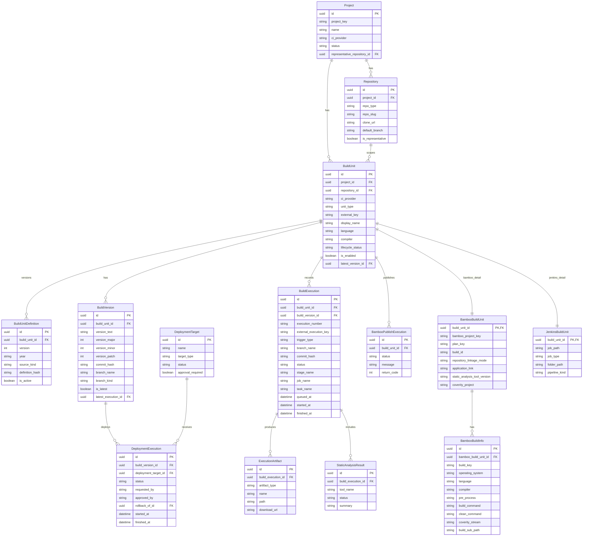

# Detailed Design: BuildUnit 중심 백엔드 모델 ERD

## 문서 메타데이터

- 문서 일자: 2026-03-25
- 문서 유형: Detailed Design
- 관련 설계: [./buildunit_backend_model_draft.md](./buildunit_backend_model_draft.md)
- 관련 설계: [./backend_model_generalization_review.md](./backend_model_generalization_review.md)

## 요약

이 문서는 `BuildUnit` 중심 신규 백엔드 모델 초안을 ERD 관점에서 정리한다. 구현 재구성은 본 ERD를 기준 관계 모델로 사용한다.

## ERD

## 관계 해설

- `Project -> Repository`
  - 프로젝트는 여러 저장소를 가질 수 있다.
- `Project -> BuildUnit`
  - 프로젝트는 여러 build unit을 가질 수 있다.
- `Repository -> BuildUnit`
  - 하나의 저장소 아래 여러 build unit이 연결될 수 있다.
- `BuildUnit -> BuildUnitDefinition`
  - 정의 스냅샷은 build unit 단위로 누적된다.
- `BuildUnit -> BuildVersion -> BuildExecution`
  - 버전과 실행 이력의 기준 단위를 `BuildUnit`으로 통일한다.
- `BuildUnit -> BambooBuildUnit` / `BuildUnit -> JenkinsBuildUnit`
  - provider 전용 상세는 코어 모델과 1:1로 분리한다.
- `BambooBuildUnit -> BambooBuildInfo`
  - Bamboo에서만 필요한 세부 build key 구조를 별도 모델로 유지한다.

## 1차 구현 시 필수 관계

- `Project -> Repository`
- `Project -> BuildUnit`
- `BuildUnit -> BuildUnitDefinition`
- `BuildUnit -> BuildVersion`
- `BuildUnit -> BuildExecution`
- `BuildUnit -> BambooBuildUnit`
- `BambooBuildUnit -> BambooBuildInfo`
- `BuildUnit -> JenkinsBuildUnit`

## 2차 구현 시 확장 관계

- `BuildExecution -> ExecutionArtifact`
- `BuildVersion -> DeploymentExecution -> DeploymentTarget`
- `BuildExecution -> StaticAnalysisResult`
- `BuildUnit -> BambooPublishExecution`

## 메모

- 본 ERD는 신규 스키마 기준이다.
- 기존 `BuildPlan`, `BuildPlanBuildInfo`, `ProjectBuild`, `BuildPlanDefinition` 계열은 이 ERD에 포함하지 않는다.
- provider별 시스템 운영 현황 스냅샷은 코어 `SystemStatusSnapshot` 또는 provider별 상세 snapshot으로 후속 확장 가능하다.
